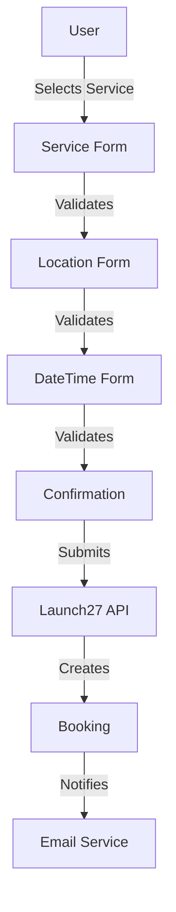
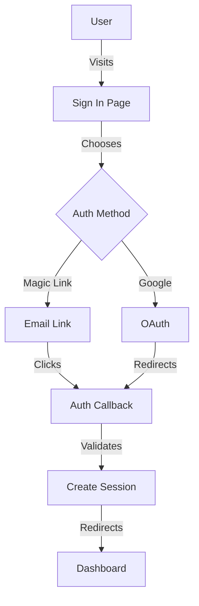
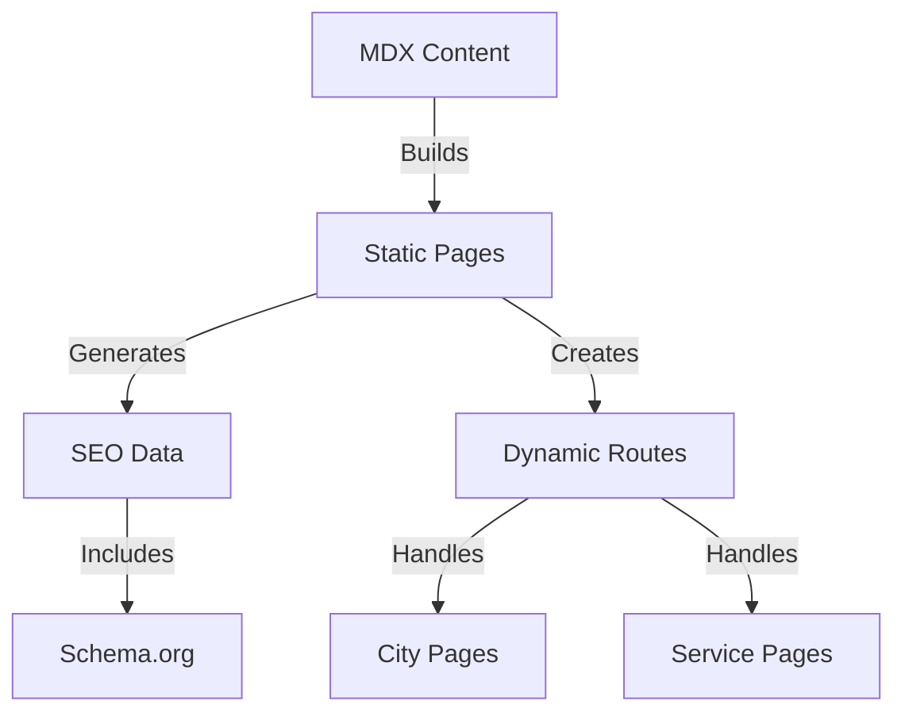
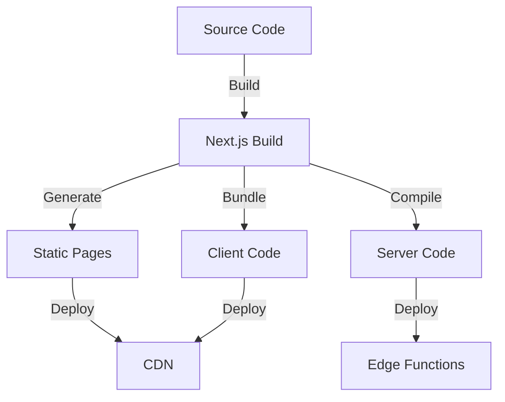

```markdown
# SimplyMaid Architecture Documentation

## System Overview

### Core Technologies
- **Framework**: Next.js 14 with App Router
- **Database**: Supabase (PostgreSQL)
- **ORM**: Drizzle
- **UI**: shadcn/ui + Tailwind CSS
- **Auth**: Supabase Auth
- **Storage**: Supabase storage
- **Payments**: LAUNCH27 API
- **Email**: BentoNow + React email

### Project Structure
```
/app
├── (marketing)/     # Public pages & SEO content
│   ├── page.tsx    # Homepage
│   ├── [city]/     # City-specific pages
│   └── services/   # Service pages
├── (auth)/         # Authentication flows
│   ├── signin/     # Sign in page
│   └── callback/   # OAuth callback
├── (booking)/      # Booking system
│   ├── flow/       # Multi-step booking
│   └── confirm/    # Confirmation
└── (dashboard)/    # Protected areas
    ├── customer/   # Customer portal
    ├── cleaner/    # Cleaner portal
    └── admin/      # Admin dashboard

/components
├── ui/            # Base shadcn components
├── sections/      # Page sections
│   ├── Hero/
│   └── Features/
├── booking/       # Booking components
│   ├── AddressForm/
│   └── ServiceSelect/
└── dashboard/     # Dashboard components
    ├── customer/
    ├── cleaner/
    └── admin/

/lib
├── api/          # API clients
├── auth/         # Auth utilities
├── db/           # Database (Drizzle)
└── utils/        # Shared utilities

/content         # MDX content
├── cities/      # City content
├── services/    # Service content
└── blog/        # Blog posts
```

## Core Systems

### 1. Authentication System
```typescript
// lib/auth/types.ts
type UserRole = "customer" | "cleaner" | "admin"

interface AuthConfig {
  providers: {
    google: boolean
    magic: boolean
  }
  routes: {
    signIn: string
    callback: string
    dashboard: string
  }
  roles: Record<UserRole, string[]>
}

// lib/auth/config.ts
export const authConfig: AuthConfig = {
  providers: {
    google: true,
    magic: true
  },
  routes: {
    signIn: "/(auth)/signin",
    callback: "/(auth)/callback",
    dashboard: "/(dashboard)"
  },
  roles: {
    customer: ["booking:create", "booking:read"],
    cleaner: ["booking:read", "availability:manage"],
    admin: ["*"]
  }
}
```

### 2. Booking System
```typescript
// lib/booking/types.ts
interface BookingFlow {
  steps: {
    service: BookingService
    location: BookingLocation
    datetime: BookingDateTime
    extras: BookingExtras
    confirmation: BookingConfirmation
  }
  validation: Record<keyof BookingFlow["steps"], z.ZodSchema>
  pricing: PricingCalculator
}

// lib/booking/config.ts
export const bookingConfig: BookingConfig = {
  services: [
    { id: "regular", name: "Regular Cleaning" },
    { id: "deep", name: "Deep Cleaning" },
    { id: "end-of-lease", name: "End of Lease" }
  ],
  locations: {
    sydney: ["Inner West", "Eastern Suburbs"],
    melbourne: ["CBD", "Inner Suburbs"]
  },
  pricing: {
    base: {
      regular: 120,
      deep: 180,
      "end-of-lease": 250
    },
    extras: {
      windows: 30,
      fridge: 25
    }
  }
}
```

### 3. Content Management
```typescript
// lib/content/types.ts
interface ContentConfig {
  cities: City[]
  services: Service[]
  seo: {
    templates: Record<string, string>
    schema: Record<string, object>
  }
}

// lib/content/config.ts
export const contentConfig: ContentConfig = {
  cities: [
    {
      name: "Sydney",
      slug: "sydney",
      regions: ["Inner West", "Eastern Suburbs"]
    }
  ],
  services: [
    {
      name: "Regular Cleaning",
      slug: "regular-cleaning",
      features: string[]
    }
  ],
  seo: {
    templates: {
      city: "%city% House Cleaning Services",
      service: "%service% in %city%"
    }
  }
}
```

## Data Flow

### 1. Booking Flow


### 2. Authentication Flow


### 3. Content Flow


## Security Architecture

### 1. Authentication Security
- Magic link authentication
- OAuth 2.0 with Google
- JWT session management
- RBAC (Role-Based Access Control)

### 2. API Security
```typescript
// middleware.ts
export const config = {
  matcher: [
    "/api/:path*",
    "/(dashboard)/:path*"
  ]
}

export async function middleware(req: NextRequest) {
  // Rate limiting
  const ip = req.ip ?? "127.0.0.1"
  const rateLimit = await getRateLimit(ip)
  
  // Auth verification
  const session = await getSession(req)
  
  // Role checking
  const canAccess = await checkAccess(session, req.nextUrl.pathname)
}
```

### 3. Data Security
- Supabase RLS policies
- API route protection
- Input validation with Zod
- XSS prevention
- CSRF protection

## Performance Optimization

### 1. Static Generation
```typescript
// app/(marketing)/[city]/page.tsx
export async function generateStaticParams() {
  return cities.map((city) => ({
    city: city.slug
  }))
}

export const dynamicParams = false
```

### 2. Image Optimization
```typescript
// next.config.js
module.exports = {
  images: {
    domains: ["supabase.co"],
    formats: ["image/avif", "image/webp"],
    deviceSizes: [640, 750, 828, 1080, 1200]
  }
}
```

### 3. Caching Strategy
```typescript
// lib/cache.ts
export const cache = {
  booking: {
    ttl: 60 * 5, // 5 minutes
    revalidate: true
  },
  content: {
    ttl: 60 * 60 * 24, // 24 hours
    revalidate: false
  }
}
```

## Monitoring & Analytics

### 1. Error Tracking
```typescript
// lib/monitoring/error.ts
export async function trackError(error: Error, context?: any) {
  await db.errors.create({
    data: {
      message: error.message,
      stack: error.stack,
      context,
      timestamp: new Date()
    }
  })
}
```

### 2. Performance Monitoring
```typescript
// lib/monitoring/metrics.ts
export async function trackMetric(
  name: string,
  value: number,
  tags?: Record<string, string>
) {
  await db.metrics.create({
    data: {
      name,
      value,
      tags,
      timestamp: new Date()
    }
  })
}
```

### 3. User Analytics
```typescript
// lib/monitoring/analytics.ts
export async function trackEvent(
  userId: string,
  event: string,
  properties?: Record<string, any>
) {
  await db.events.create({
    data: {
      userId,
      event,
      properties,
      timestamp: new Date()
    }
  })
}
```

## Deployment Architecture

### 1. Build Process


### 2. Infrastructure
- Edge Functions for API routes
- CDN for static assets
- PostgreSQL for data storage
- Redis for caching
- S3 for file storage

### 3. Scaling Strategy
- Horizontal scaling for API
- CDN caching for static pages
- Database connection pooling
- Rate limiting at edge
- Cache warming for popular routes
```