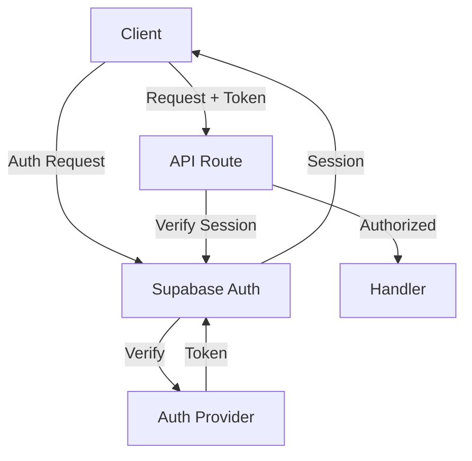

```markdown
# Authentication Documentation

## Overview

SimplyMaid uses Supabase Auth for:
- Magic link authentication
- Google OAuth
- Role-based access control
- Protected routes & API endpoints

## Architecture



## Authentication Flow

### 1. Magic Link Flow
```typescript
// components/auth/MagicLink.tsx
"use client";

export function MagicLinkAuth() {
  const [email, setEmail] = useState("");
  const [isLoading, setIsLoading] = useState(false);
  
  const handleSubmit = async (e: React.FormEvent) => {
    e.preventDefault();
    setIsLoading(true);
    
    try {
      const { error } = await supabase.auth.signInWithOtp({
        email,
        options: {
          emailRedirectTo: `${window.location.origin}/auth/callback`
        }
      });

      if (error) throw error;
      
      toast.success("Check your email for the login link!");
    } catch (error) {
      toast.error(error.message);
    } finally {
      setIsLoading(false);
    }
  };

  return (
    <form onSubmit={handleSubmit}>
      <input
        type="email"
        value={email}
        onChange={(e) => setEmail(e.target.value)}
        required
      />
      <button type="submit" disabled={isLoading}>
        {isLoading ? "Sending..." : "Send Magic Link"}
      </button>
    </form>
  );
}
```

### 2. Google OAuth Flow
```typescript
// components/auth/GoogleAuth.tsx
"use client";

export function GoogleAuth() {
  const handleSignIn = async () => {
    const { error } = await supabase.auth.signInWithOAuth({
      provider: "google",
      options: {
        redirectTo: `${window.location.origin}/auth/callback`
      }
    });

    if (error) {
      toast.error(error.message);
    }
  };

  return (
    <button onClick={handleSignIn}>
      Continue with Google
    </button>
  );
}
```

### 3. Auth Callback
```typescript
// app/auth/callback/route.ts
import { createClient } from "@/libs/supabase/server";
import { NextResponse } from "next/server";

export async function GET(request: Request) {
  const requestUrl = new URL(request.url);
  const code = requestUrl.searchParams.get("code");

  if (code) {
    const supabase = createClient();
    await supabase.auth.exchangeCodeForSession(code);
  }

  return NextResponse.redirect(requestUrl.origin);
}
```

## Protected Routes

### 1. Middleware Protection
```typescript
// middleware.ts
import { createMiddlewareClient } from "@supabase/auth-helpers-nextjs";
import { NextResponse } from "next/server";

export async function middleware(req: NextRequest) {
  const res = NextResponse.next();
  const supabase = createMiddlewareClient({ req, res });
  
  const {
    data: { session },
  } = await supabase.auth.getSession();

  // Protect dashboard routes
  if (req.nextUrl.pathname.startsWith("/dashboard")) {
    if (!session) {
      return NextResponse.redirect(new URL("/login", req.url));
    }

    // Check role-based access
    if (
      req.nextUrl.pathname.startsWith("/dashboard/admin") && 
      session.user.role !== "admin"
    ) {
      return NextResponse.redirect(new URL("/dashboard", req.url));
    }
  }

  return res;
}
```

### 2. API Route Protection
```typescript
// libs/auth.ts
import { createClient } from "@/libs/supabase/server";
import { NextResponse } from "next/server";

export async function withAuth(
  handler: (req: Request, session: Session) => Promise<Response>
) {
  return async (req: Request) => {
    const supabase = createClient();
    
    const {
      data: { session },
    } = await supabase.auth.getSession();

    if (!session) {
      return NextResponse.json(
        { error: "Unauthorized" },
        { status: 401 }
      );
    }

    return handler(req, session);
  };
}

// Usage in API route
export const GET = withAuth(async (req, session) => {
  // Handler implementation
});
```

## Role-Based Access Control

### 1. Role Types
```typescript
// types/auth.ts
export type UserRole = "customer" | "cleaner" | "admin";

export interface UserProfile {
  id: string;
  role: UserRole;
  permissions: string[];
}
```

### 2. Role Configuration
```typescript
// config/roles.ts
export const roles = {
  customer: {
    permissions: [
      "booking:create",
      "booking:read",
      "booking:update",
      "profile:read",
      "profile:update"
    ]
  },
  cleaner: {
    permissions: [
      "booking:read",
      "booking:update",
      "availability:manage",
      "profile:read",
      "profile:update"
    ]
  },
  admin: {
    permissions: [
      "*:*" // All permissions
    ]
  }
} as const;
```

### 3. Permission Checking
```typescript
// libs/auth.ts
export function hasPermission(
  user: UserProfile,
  permission: string
): boolean {
  if (user.role === "admin") return true;
  
  return roles[user.role].permissions.includes(permission);
}

export function requirePermission(permission: string) {
  return withAuth(async (req, session) => {
    const user = await getUserProfile(session.user.id);
    
    if (!hasPermission(user, permission)) {
      return NextResponse.json(
        { error: "Forbidden" },
        { status: 403 }
      );
    }
    
    return handler(req, session);
  });
}
```

## Client-Side Auth

### 1. Auth Provider
```typescript
// components/providers/AuthProvider.tsx
"use client";

import { createContext, useContext, useEffect, useState } from "react";
import { createClient } from "@/libs/supabase/client";

const AuthContext = createContext<{
  user: User | null;
  profile: UserProfile | null;
  signOut: () => Promise<void>;
}>(null);

export function AuthProvider({ children }: { children: React.ReactNode }) {
  const [user, setUser] = useState<User | null>(null);
  const [profile, setProfile] = useState<UserProfile | null>(null);
  const supabase = createClient();

  useEffect(() => {
    // Get initial session
    supabase.auth.getSession().then(({ data: { session } }) => {
      if (session?.user) {
        setUser(session.user);
        fetchProfile(session.user.id);
      }
    });

    // Listen for auth changes
    const {
      data: { subscription },
    } = supabase.auth.onAuthStateChange((event, session) => {
      setUser(session?.user ?? null);
      if (session?.user) {
        fetchProfile(session.user.id);
      } else {
        setProfile(null);
      }
    });

    return () => subscription.unsubscribe();
  }, []);

  const fetchProfile = async (userId: string) => {
    const { data } = await supabase
      .from("profiles")
      .select("*")
      .eq("id", userId)
      .single();
      
    setProfile(data);
  };

  const signOut = async () => {
    await supabase.auth.signOut();
  };

  return (
    <AuthContext.Provider value={{ user, profile, signOut }}>
      {children}
    </AuthContext.Provider>
  );
}

export const useAuth = () => {
  const context = useContext(AuthContext);
  if (!context) {
    throw new Error("useAuth must be used within an AuthProvider");
  }
  return context;
};
```

### 2. Protected Components
```typescript
// components/auth/RequireAuth.tsx
"use client";

import { useAuth } from "@/components/providers/AuthProvider";
import { redirect } from "next/navigation";

export function RequireAuth({
  children,
  permission
}: {
  children: React.ReactNode;
  permission?: string;
}) {
  const { user, profile } = useAuth();

  if (!user) {
    redirect("/login");
  }

  if (permission && !hasPermission(profile, permission)) {
    redirect("/dashboard");
  }

  return children;
}
```

## Security Considerations

### 1. Password Security
- Magic links preferred over passwords
- OAuth for social login
- No password storage needed

### 2. Session Management
```typescript
// config/auth.ts
export const authConfig = {
  cookies: {
    name: "sb-auth",
    lifetime: 60 * 60 * 24 * 7, // 1 week
    domain: process.env.COOKIE_DOMAIN,
    sameSite: "lax" as const,
    secure: process.env.NODE_ENV === "production"
  }
};
```

### 3. Rate Limiting
```typescript
// libs/rateLimit.ts
export const authRateLimit = rateLimit({
  interval: 60 * 1000, // 1 minute
  uniqueTokenPerInterval: 500,
  limit: {
    "magic-link": 3,
    "oauth": 5
  }
});
```

## Testing

### 1. Auth Helpers
```typescript
// tests/helpers/auth.ts
export async function signInUser() {
  const supabase = createClient();
  
  const { data: { user } } = await supabase.auth.signUp({
    email: "test@example.com",
    password: "password"
  });

  return user;
}

export function mockAuthSession(role: UserRole = "customer") {
  const user = {
    id: "test-user",
    email: "test@example.com",
    role
  };

  // Mock Supabase client
  jest.spyOn(require("@supabase/auth-helpers-nextjs"), "createClientComponentClient").mockImplementation(() => ({
    auth: {
      getSession: () => Promise.resolve({ data: { session: { user } } })
    }
  }));

  return user;
}
```

### 2. Component Tests
```typescript
// tests/components/RequireAuth.test.tsx
describe("RequireAuth", () => {
  it("redirects to login when not authenticated", () => {
    const redirect = jest.fn();
    jest.spyOn(require("next/navigation"), "redirect").mockImplementation(redirect);

    render(
      <RequireAuth>
        <div>Protected Content</div>
      </RequireAuth>
    );

    expect(redirect).toHaveBeenCalledWith("/login");
  });

  it("allows access with correct permission", () => {
    mockAuthSession("admin");

    const { getByText } = render(
      <RequireAuth permission="booking:create">
        <div>Protected Content</div>
      </RequireAuth>
    );

    expect(getByText("Protected Content")).toBeInTheDocument();
  });
});
```

## Error Handling

### 1. Auth Errors
```typescript
// libs/auth.ts
export class AuthError extends Error {
  constructor(
    message: string,
    public code: string,
    public status: number
  ) {
    super(message);
    this.name = "AuthError";
  }
}

export function handleAuthError(error: Error) {
  switch (error.message) {
    case "Email not confirmed":
      return new AuthError(
        "Please check your email to confirm your account",
        "auth/email-not-confirmed",
        400
      );
    case "Invalid login credentials":
      return new AuthError(
        "Invalid email or password",
        "auth/invalid-credentials",
        401
      );
    default:
      return new AuthError(
        "An authentication error occurred",
        "auth/unknown",
        500
      );
  }
}
```

### 2. Error Boundaries
```typescript
// components/auth/AuthErrorBoundary.tsx
"use client";

import { Component } from "react";

export class AuthErrorBoundary extends Component {
  state = { hasError: false, error: null };

  static getDerivedStateFromError(error) {
    return { hasError: true, error };
  }

  componentDidCatch(error, errorInfo) {
    console.error("Auth error:", error, errorInfo);
  }

  render() {
    if (this.state.hasError) {
      return (
        <div role="alert">
          <h2>Authentication Error</h2>
          <p>{this.state.error.message}</p>
          <button onClick={() => window.location.reload()}>
            Try Again
          </button>
        </div>
      );
    }

    return this.props.children;
  }
}
```
```