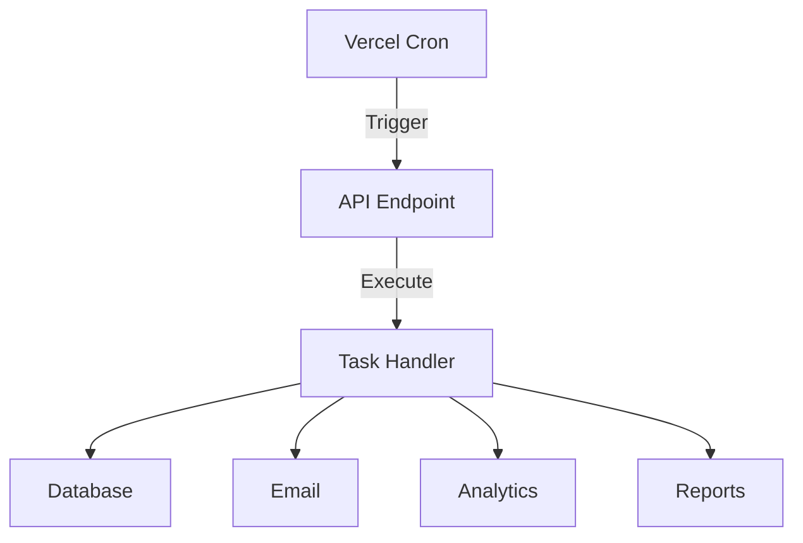

```markdown
# Cron Jobs Documentation

## Overview

SimplyMaid uses cron jobs for automated tasks including:
- Booking reminders
- Cleaner schedule updates
- Report generation
- Data backups
- SEO content updates

## Architecture



## Cron Configuration

### Vercel Cron Setup
```json
// vercel.json
{
  "crons": [
    {
      "path": "/api/cron/booking-reminders",
      "schedule": "0 18 * * *"
    },
    {
      "path": "/api/cron/cleaner-schedules",
      "schedule": "0 20 * * *"
    },
    {
      "path": "/api/cron/daily-reports",
      "schedule": "0 0 * * *"
    }
  ]
}
```

## Cron Jobs

### 1. Booking Reminders
```typescript
// /api/cron/booking-reminders/route.ts
export async function GET(req: Request) {
  try {
    // Verify cron secret
    const authHeader = req.headers.get("authorization");
    if (authHeader !== `Bearer ${process.env.CRON_SECRET}`) {
      return new Response("Unauthorized", { status: 401 });
    }

    // Get tomorrow's bookings
    const tomorrow = new Date();
    tomorrow.setDate(tomorrow.getDate() + 1);

    const bookings = await db.query.bookings.findMany({
      where: eq(bookings.date, tomorrow),
      include: {
        customer: true,
        cleaner: true
      }
    });

    // Send reminders
    for (const booking of bookings) {
      await sendBookingReminder({
        booking,
        recipient: "customer"
      });
      
      await sendBookingReminder({
        booking,
        recipient: "cleaner"
      });
    }

    return new Response("Success", { status: 200 });
  } catch (error) {
    console.error("Booking reminder error:", error);
    return new Response(error.message, { status: 500 });
  }
}
```

### 2. Cleaner Schedule Updates
```typescript
// /api/cron/cleaner-schedules/route.ts
export async function GET(req: Request) {
  try {
    // Get active cleaners
    const cleaners = await db.query.cleanerProfiles.findMany({
      where: eq(cleanerProfiles.isActive, true)
    });

    // Update availability for next week
    for (const cleaner of cleaners) {
      await updateCleanerAvailability({
        cleanerId: cleaner.id,
        startDate: getNextWeekStart(),
        endDate: getNextWeekEnd()
      });
    }

    return new Response("Success", { status: 200 });
  } catch (error) {
    console.error("Cleaner schedule error:", error);
    return new Response(error.message, { status: 500 });
  }
}
```

### 3. Daily Reports
```typescript
// /api/cron/daily-reports/route.ts
export async function GET(req: Request) {
  try {
    // Generate reports
    const yesterday = new Date();
    yesterday.setDate(yesterday.getDate() - 1);

    const reports = await generateDailyReports(yesterday);

    // Send to stakeholders
    await sendDailyReports(reports);

    // Store reports
    await db.dailyReports.create({
      data: {
        date: yesterday,
        data: reports
      }
    });

    return new Response("Success", { status: 200 });
  } catch (error) {
    console.error("Daily report error:", error);
    return new Response(error.message, { status: 500 });
  }
}
```

### 4. SEO Content Updates
```typescript
// /api/cron/content-updates/route.ts
export async function GET(req: Request) {
  try {
    // Get content needing updates
    const content = await db.query.content.findMany({
      where: lt(content.lastUpdated, getLastMonth())
    });

    // Update content
    for (const item of content) {
      await updateContent({
        id: item.id,
        type: item.type,
        citySlug: item.citySlug
      });
    }

    return new Response("Success", { status: 200 });
  } catch (error) {
    console.error("Content update error:", error);
    return new Response(error.message, { status: 500 });
  }
}
```

## Task Handlers

### Booking Reminder Handler
```typescript
async function sendBookingReminder({
  booking,
  recipient
}: {
  booking: Booking;
  recipient: "customer" | "cleaner";
}) {
  const template = recipient === "customer" 
    ? "customer-reminder"
    : "cleaner-reminder";

  await sendEmail({
    to: recipient === "customer" 
      ? booking.customer.email 
      : booking.cleaner.email,
    template,
    data: {
      booking,
      type: recipient
    }
  });

  await db.bookingReminders.create({
    data: {
      bookingId: booking.id,
      recipientType: recipient,
      sentAt: new Date()
    }
  });
}
```

### Cleaner Schedule Handler
```typescript
async function updateCleanerAvailability({
  cleanerId,
  startDate,
  endDate
}: {
  cleanerId: string;
  startDate: Date;
  endDate: Date;
}) {
  // Get existing bookings
  const bookings = await db.bookings.findMany({
    where: {
      cleanerId,
      date: {
        gte: startDate,
        lte: endDate
      }
    }
  });

  // Generate available slots
  const slots = generateAvailableSlots({
    startDate,
    endDate,
    existingBookings: bookings
  });

  // Update availability
  await db.cleanerAvailability.upsert({
    where: {
      cleanerId_week: {
        cleanerId,
        week: getWeekNumber(startDate)
      }
    },
    create: {
      cleanerId,
      week: getWeekNumber(startDate),
      slots
    },
    update: {
      slots
    }
  });
}
```

### Report Generator
```typescript
async function generateDailyReports(date: Date) {
  return {
    bookings: await generateBookingReport(date),
    revenue: await generateRevenueReport(date),
    cleaners: await generateCleanerReport(date),
    customers: await generateCustomerReport(date)
  };
}

async function generateBookingReport(date: Date) {
  const bookings = await db.bookings.findMany({
    where: {
      date: {
        equals: date
      }
    },
    include: {
      customer: true,
      cleaner: true
    }
  });

  return {
    total: bookings.length,
    completed: bookings.filter(b => b.status === "completed").length,
    cancelled: bookings.filter(b => b.status === "cancelled").length,
    byService: groupBy(bookings, "serviceType"),
    byCity: groupBy(bookings, "city")
  };
}
```

## Error Handling

### Retry Mechanism
```typescript
async function withRetry<T>(
  fn: () => Promise<T>,
  maxRetries = 3
): Promise<T> {
  let attempt = 0;
  
  while (attempt < maxRetries) {
    try {
      return await fn();
    } catch (error) {
      attempt++;
      
      if (attempt === maxRetries) {
        throw error;
      }
      
      await new Promise(resolve => 
        setTimeout(resolve, Math.pow(2, attempt) * 1000)
      );
    }
  }
}
```

### Error Logging
```typescript
async function logCronError(
  jobName: string,
  error: Error,
  context?: any
) {
  await db.cronErrors.create({
    data: {
      jobName,
      error: error.message,
      stack: error.stack,
      context,
      timestamp: new Date()
    }
  });

  // Alert if critical
  if (isCriticalJob(jobName)) {
    await sendErrorAlert({
      jobName,
      error,
      context
    });
  }
}
```

## Monitoring

### Health Checks
```typescript
async function checkCronHealth() {
  const lastDay = new Date();
  lastDay.setDate(lastDay.getDate() - 1);

  const jobs = await db.cronJobs.findMany({
    where: {
      lastRun: {
        lt: lastDay
      }
    }
  });

  if (jobs.length > 0) {
    await sendHealthAlert({
      message: "Cron jobs not running",
      jobs
    });
  }
}
```

### Metrics
```typescript
async function trackCronMetrics(
  jobName: string,
  duration: number,
  status: "success" | "failure"
) {
  await db.cronMetrics.create({
    data: {
      jobName,
      duration,
      status,
      timestamp: new Date()
    }
  });
}
```

## Testing

### Test Helpers
```typescript
// tests/helpers/cron.ts
export function mockCronRequest(secret = process.env.CRON_SECRET) {
  return new Request("http://localhost:3000", {
    headers: {
      authorization: `Bearer ${secret}`
    }
  });
}

export function createTestBooking(date: Date) {
  return {
    id: "test-booking",
    date,
    status: "confirmed",
    customer: {
      email: "test@example.com"
    },
    cleaner: {
      email: "cleaner@example.com"
    }
  };
}
```

### Job Tests
```typescript
// tests/cron/booking-reminders.test.ts
describe("Booking Reminders Cron", () => {
  it("sends reminders for tomorrow's bookings", async () => {
    // Create test booking
    const tomorrow = new Date();
    tomorrow.setDate(tomorrow.getDate() + 1);
    
    await db.bookings.create({
      data: createTestBooking(tomorrow)
    });

    // Run cron
    const response = await GET(mockCronRequest());
    expect(response.status).toBe(200);

    // Verify reminders
    const reminders = await db.bookingReminders.findMany();
    expect(reminders).toHaveLength(2); // Customer + Cleaner
  });

  it("handles unauthorized requests", async () => {
    const response = await GET(mockCronRequest("wrong-secret"));
    expect(response.status).toBe(401);
  });
});
```
```